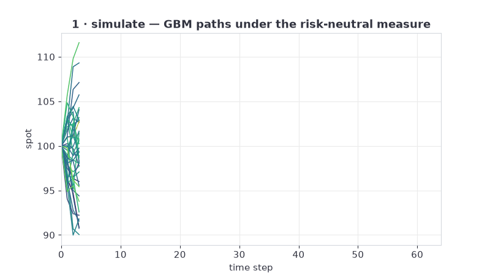

# Deep Hedging & Pricing Simulator

[](https://github.com/pmasousa/deep-hedging-pricing-simulator/actions/workflows/ci.yml)

Live results page: https://pmasousa.github.io/deep-hedging-pricing-simulator/



European option pricing and hedging in PyTorch, float64 throughout. Greeks
are computed three independent ways (analytic Black-Scholes, autograd,
pathwise Monte Carlo) and the test suite checks that they agree. Two models
train on top: a differential ML pricer (Huge & Savine, 2020) and a deep
hedging policy under transaction costs (Buehler et al., 2019).

## Validation

1. **Analytic** Black-Scholes formulas, the reference.
2. **Autograd**: `torch.autograd.grad` on the same pricer.
3. **Pathwise Monte Carlo**: backpropagation through simulated GBM paths.

Autograd matches the formulas to 1e-10; the Monte Carlo estimators fall
inside CLT bands around them. The three routes share no code, so a bug has
to appear in all three to pass.

## Results

Differential training vs a price-only baseline, same network and data
(100k Sobol samples, 300 epochs, float64; reproduce with
`scripts/benchmark.py`):

| learner | price MAE | delta MAE | OOD price MAE | OOD delta MAE |
|---|---|---|---|---|
| DML | 0.053 | 0.0042 | 0.45 | 0.027 |
| baseline | 0.127 | 0.0122 | 1.33 | 0.032 |

Speed at matched error: Monte Carlo is timed with the path count its CLT
standard error needs to match the learner's price accuracy (73,544 paths).

| device | method | µs per price |
|---|---|---|
| cpu | Monte Carlo, matched error | 104,000 |
| cpu | DML, batched 100k options | 0.79 |
| cuda | DML, batched 100k options | 0.0039 |

Gamma is not a training label; it is computed by a second autograd pass
through the trained network.

Deep hedging: a policy network trained on entropic risk of hedging P&L
beats weekly delta hedging on CVaR95 (−3.57 vs −4.24 at 1% costs) with
less traded volume. A fairly priced book has zero expected P&L by
construction; the improvement is cost efficiency, not alpha.

## HTTP API

The same frozen learners behind three endpoints (`src/dhps/api/`):

| endpoint | input | output |
|---|---|---|
| `POST /price` | spot, strike, T, σ | learned call price |
| `POST /greeks` | spot, strike, T, σ | delta, gamma, vega, theta, dual delta — autograd through the net |
| `POST /hedge` | spot, strike, τ, position | target stock position in [0, 1] |
| `GET /meta` | — | budgets, served metrics, valid input box |

Requests outside the training box return 422 — out-of-distribution error
is measured, not clamped. Rates r = 0.05, q = 0.01 are dataset constants,
disclosed by `/meta`.

```bash
uv run --extra api uvicorn dhps.api.app:app --port 8000
```

Single-request latency at matched Monte Carlo error (CPU, in-process,
Windows 11; reproduce with `scripts/benchmark_api.py`): `/price` p50
2.1 ms against 141 ms per matched-error MC price — 67x at p50, 21x at
p99, versus the 10x design gate.

Docker builds a CPU image that trains the full-budget learners at build
time, so the container starts warm:

```bash
docker build -t dhps-api .
docker run -p 8000:8000 dhps-api
```

## Quickstart

```bash
# install (CPU; add --extra gpu for CUDA torch)
uv sync --extra dev

# test suite
uv run pytest -q

# dashboard
uv run --extra app streamlit run app/dashboard.py

# http api over the trained learners
uv run --extra api uvicorn dhps.api.app:app --port 8000

# train a learner
uv run python scripts/train.py --dml --epochs 300

# benchmarks (writes reports/benchmarks/)
uv run python scripts/benchmark.py --samples 100000 --epochs 300 --device cuda
```

## Structure

```
src/dhps/
  simulators/   GBM paths, differentiable end to end
  pricing/      Black-Scholes, autograd Greeks, pathwise MC Greeks
  datasets/     Sobol sampler, gradient labels, normalization
  models/       MLP, differential loss
  train/        training loop, run folders
  bench/        accuracy/OOD metrics, Greeks curves, matched-error speed
  hedging/      cost-aware P&L simulator, deep hedging policy
  api/          FastAPI service over the frozen learners
app/            Streamlit dashboard
scripts/        train, benchmark, ablations, api latency, site
tests/          statistical and regression gates
```

Components with a closed form are tested against it; learned components
are tested against baselines. Regression gates in `tests/` fail the build
if either degrades.

## License

MIT, see [LICENSE](LICENSE).
